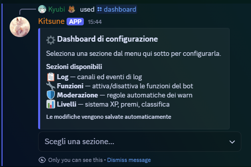
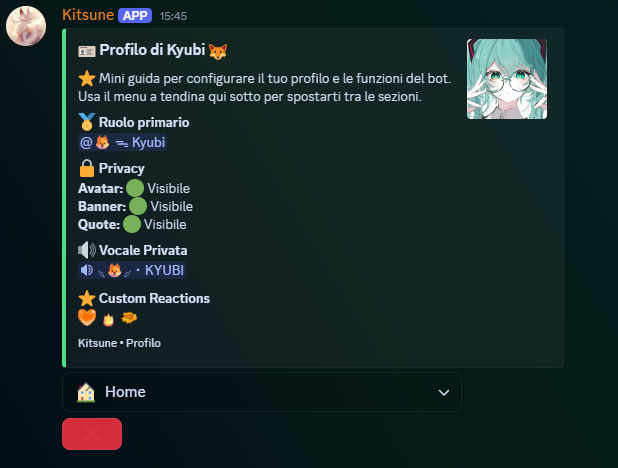

# 🦊 Kitsune Bot

A multi-purpose Discord bot written in **Python** (`discord.py`): moderation, anti-spam,
full audit logging, leveling, user profiles and more — all configurable from an
**interactive in-chat dashboard**, with no need to touch code or config files.

> A real bot in daily use on a community server. Modular **cog** architecture,
> **SQLite** persistence, fully **per-server** configuration.

---

## ✨ Features

### 🛡️ Moderation
- **Ban · Hackban** (ban by ID, even if the user isn't in the server) **· Unban · Kick**
- **Timeout · Untimeout** · **Lock / Unlock** channels · **Slowmode** · **Clear** with filters (user / links / images / bots)
- **Warn** with reason & proof + **auto-rules** (at N warns → timeout / kick / ban), plus `warnings · delwarn · clearwarns`
- **Jail** — isolation system (dedicated role + channel, auto-hides new channels)
- **Banlist · Serverinfo · Userinfo**

### 🚨 Anti-spam & Safety
- 7 categories (spam, mentions, links, duplicates, selfbot, external commands, raid-level spam) with **configurable sanctions** (warn / timeout / kick / softban / ban)
- **Anti-scam** link filtering · **Whitelist** for channels / roles / users
- **DM Lock** & **Join Lock** (toggle Discord's native pause-DMs / pause-invites)

### 📋 Logging
Categories: **Members · Messages · Voice · Channels · Roles · Server · Actions · Mod Logs**
- Per-category channel with individually toggleable events · channel **blacklist**
- Attachments (files / gifs / audio), reactions, pins, threads, webhooks, channel permissions
- Voice split into 3 streams (join/leave · mute/deaf · stream) with **session duration**
- Invite tracking on join · **Copy ID** button

### 👤 User Profiles — `+profile`
- **Privacy**: hide your avatar / banner / quotes from others (with a configurable role-based bypass)
- **Custom reactions**: the bot reacts with your chosen emoji **when you get tagged** (mode: "tag only" or "anywhere")
- **Self-role categories**: pick your own roles by category (e.g. region, age), single- or multi-choice
- **Primary role** & **private voice channel** assignable by staff

### 🏆 Leveling
- `+rank` / `+r` · `+leaderboard` / `+lb`
- `/level give · giverole · set · reset` (admin)

### 🎭 Roles
- `/role add · remove · all · humans · bots` · **Autorole** on join

### 📝 Embed Builder
- `/embed create · edit · list · delete · send` with **live preview** and modals
- Dynamic variables (`{user}`, `{user_avatar}`, `{server_membercount}`, …)

### 📨 Auto Message & ⭐ Auto React
- Automated messages and automatic reactions to keywords or mentions — configured from the dashboard

### 👋 Greetings & Boost · 🤫 Confessions · 🤝 Partnership
- `/set greet · /set boost` (+ `/test greet · /test boost`) · `/confession write` with anti-abuse staff log · `/partnership`

### 🎉 Fun & Minigames
- `+ship` (generated image + 24h marriage) · `+marriage`
- **Make it a Quote** (right-click menu or `+quote` on a reply) · `+av · +avuser · +banner · +banneruser`
- `+moneta · +8ball · +rps · +indovina`

### ⚙️ Dashboard
`/dashboard` — interactive panel to configure **everything**: logs, features, moderation, anti-spam and profiles.

---

## 🧱 Tech Stack
**Python** · **discord.py 2.x** (slash commands, context menus, UI components) · **SQLite** · **Pillow** (ship image generation)

## 📁 Project Structure
```
Kitsune Bot/
├── main.py            # Startup, cog loading, command sync
├── database.py        # SQLite persistence (per-server config, levels, profiles…)
├── logconfig.py       # Log categories, feature flags & helpers
├── levelsystem.py     # XP / leveling logic
├── requirements.txt
└── cogs/              # moderation · antispam · logs · dashboard · roles
                       # levels · profile · embedbuilder · greetings
                       # confession · automessages · autoreact · partnership
                       # fun · minigames · quote · avatar
```

## 📸 Screenshots

| Configuration Dashboard | User Profile |
|:---:|:---:|
|  |  |

---

## 🚀 Setup
1. Install the dependencies:
   ```
   pip install -r requirements.txt
   ```
2. Create a `.env` file:
   ```
   DISCORD_TOKEN=your_token_here
   GUILD_ID=server_id   # optional: instant slash-command sync (empty = global)
   BOT_STATUS=your text # optional: bot custom status (empty = none)
   ```
3. Run it:
   ```
   python main.py
   ```

> Requires the **Privileged Intents** (Server Members + Message Content) enabled in the Discord Developer Portal.

---

*Personal project. Code shared for demonstration / portfolio purposes.*
